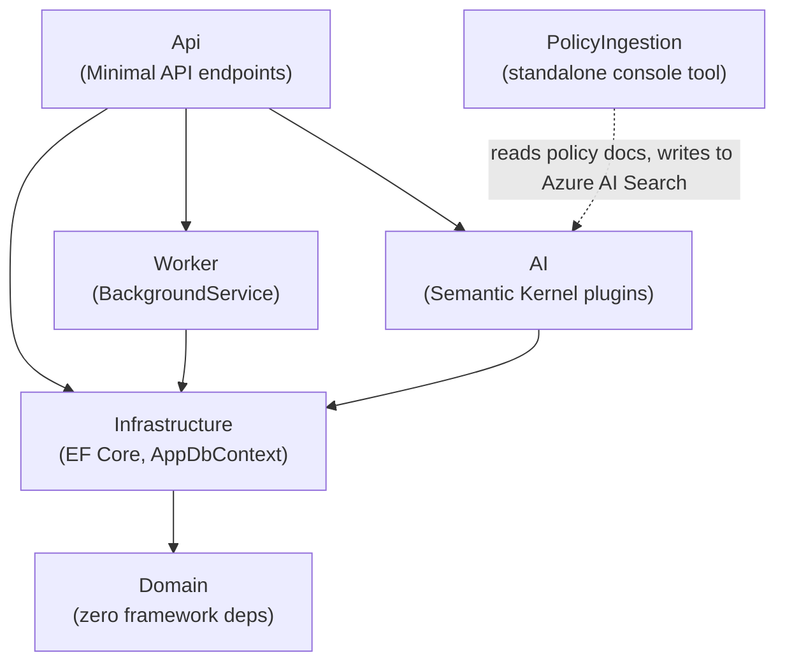
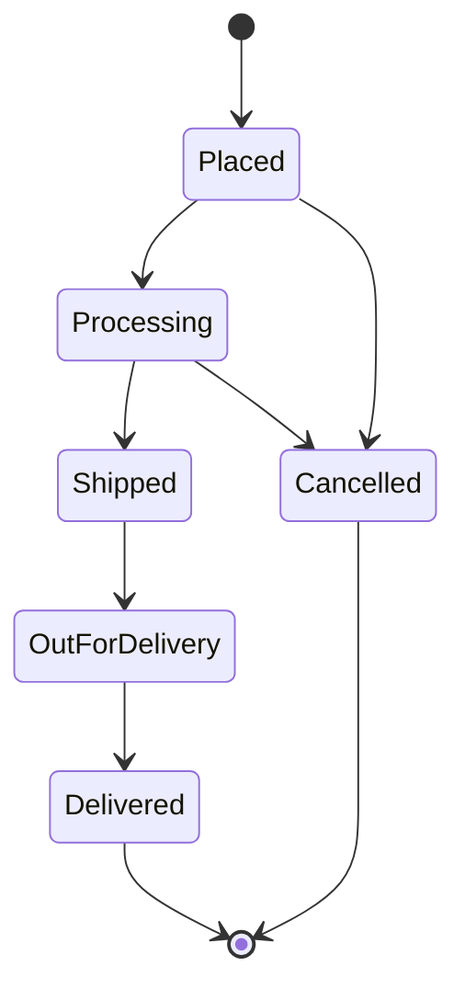

# Order Tracking System with RAG Chatbot

[](https://github.com/Jay-A-Kad/Order-Tracking-System-RagBot/actions/workflows/ci.yml)

## Overview

A .NET order-tracking backend with an **agentic RAG chatbot** built using .NET, Azure, and AI integration. It's grounded in live backend data through function calling — ask it where an order is, whether something's in stock, or what the return policy covers, and it calls functions against a database and a vector index to answer.

## Architecture

A modular monolith with a strict, one-way dependency direction.



**Order lifecycle**: every transition is validated server-side in a domain method, never trusted from a client:



`Processing` → `Shipped` → `OutForDelivery` → `Delivered` all happen automatically, driven by `ShipmentSimulatorService` — a `BackgroundService` on a 2-minute `PeriodicTimer` that polls for orders eligible to advance on time-based eligibility. An order becomes eligible once it's sat in its current status longer than a 1-minute cutoff, capped at a batch of 10 per status per tick, oldest-first, to avoid indefinite starving.

**The AI layer**: 3 Semantic Kernel plugins, discoverable by the model and selected automatically via `FunctionChoiceBehavior.Auto()`:

- **`OrderPlugin`**: `list_my_orders()`, `get_order_status(orderId)`
- **`InventoryPlugin`**: `check_stock(sku)`
- **`KnowledgeBasePlugin`**: `search_policies(query)`

## Tech Stack

| Area | Technologies |
| --- | --- |
| Core | C#, .NET 10, ASP.NET Core Minimal APIs |
| Data | Entity Framework Core, Azure SQL Database |
| AI | Semantic Kernel, Azure OpenAI, function calling / agentic AI |
| RAG | Azure AI Search, custom chunking + embedding ingestion pipeline |
| Observability | Serilog, OpenTelemetry, Azure Application Insights |
| CI/CD | GitHub Actions |
| Testing | xUnit |

## Installation

### 1. Clone and restore

```bash
git clone https://github.com/Jay-A-Kad/Order-Tracking-System-RagBot.git
cd Order-Tracking-System-RagBot
dotnet restore
```

### 2. Configure secrets

Set these via `dotnet user-secrets`, scoped to `src/Api`:

```bash
dotnet user-secrets set "ConnectionStrings:AppDb" "<your Azure SQL connection string>" --project src/Api
dotnet user-secrets set "AzureOpenAI:Endpoint" "<your Azure OpenAI endpoint>" --project src/Api
dotnet user-secrets set "AzureOpenAI:ApiKey" "<your Azure OpenAI key>" --project src/Api
dotnet user-secrets set "AzureOpenAI:EmbeddingDeployment" "<your embedding deployment name>" --project src/Api
dotnet user-secrets set "AzureSearch:Endpoint" "<your Azure AI Search endpoint>" --project src/Api
dotnet user-secrets set "AzureSearch:AdminKey" "<your Azure AI Search admin key>" --project src/Api
dotnet user-secrets set "ApplicationInsights:ConnectionString" "<your Application Insights connection string>" --project src/Api
```

### 3. Apply database migrations

```bash
dotnet ef database update --project src/Infrastructure --startup-project src/Api
```

### 4. Seed the policy knowledge base (one time)

```bash
dotnet run --project tools/PolicyIngestion/PolicyIngestion.csproj
```

### 5. Run the API

```bash
dotnet run --project src/Api
```

The `ShipmentSimulatorService` background worker starts automatically with the API.
